# MyLearn Enbital - Public Showcase

> Una demo e-learning privata, raccontata pubblicamente senza esporre codice sorgente.  
> Questo repository contiene solo documentazione, screenshot e media selezionati.

## Il Problema

Molti corsi obbligatori di sicurezza sul lavoro sono ancora percepiti come contenuti passivi: video lunghi, slide lineari, test finale separato dal percorso. MyLearn Enbital nasce da una domanda diversa:

**e se un corso obbligatorio potesse essere guidato, interattivo e verificabile passo dopo passo, senza perdere rigore formativo?**

La demo mostra una possibile risposta: un'esperienza dual-screen in cui il desktop diventa il palco didattico, il telefono diventa lo strumento operativo dello studente e un avatar tutor accompagna ogni blocco della lezione.

## Cosa Mostra La Demo

- Un avatar tutor, Elena, integrato nel course player.
- Un sistema a blocchi indipendenti, progettato per costruire corsi modificabili e riutilizzabili.
- Spiegazioni brevi e progressive, alternate a micro-verifiche.
- Mappe concettuali e card didattiche che seguono in tempo reale il parlato dell'avatar.
- Un companion mobile usato per navigare, rispondere, classificare rischi e prendere decisioni.
- Sincronizzazione realtime tra desktop e telefono.
- Un quiz finale e un event log dimostrativo per raccontare tracciabilita e partecipazione.

## Demo Preview

### Dashboard

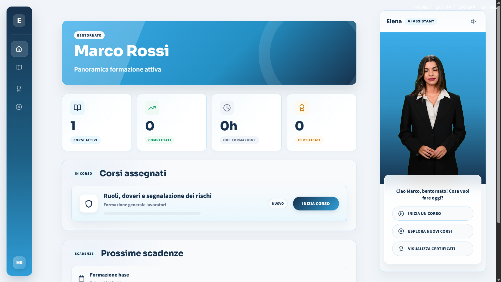

### Ingresso Corso E Avatar

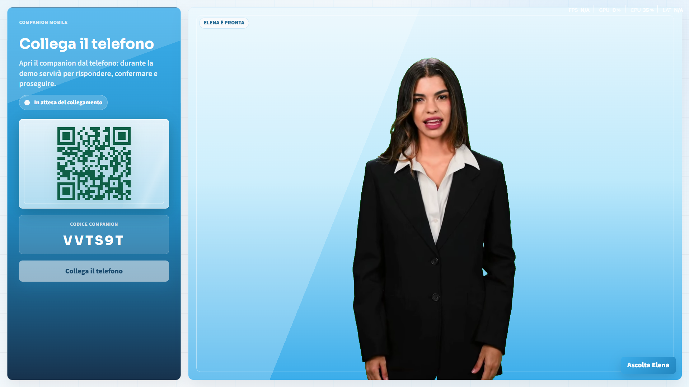

### Pairing Desktop-Mobile

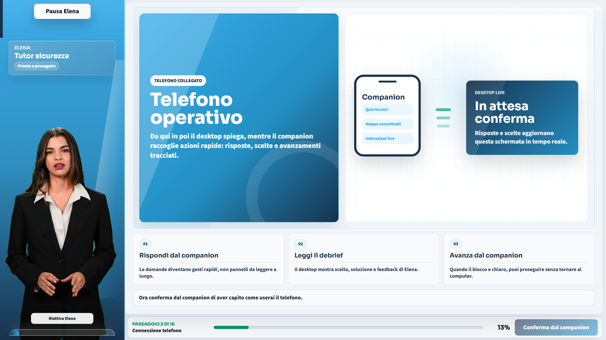

### Blocco Formativo Con Mappa Concettuale


### Identificazione Dei Rischi

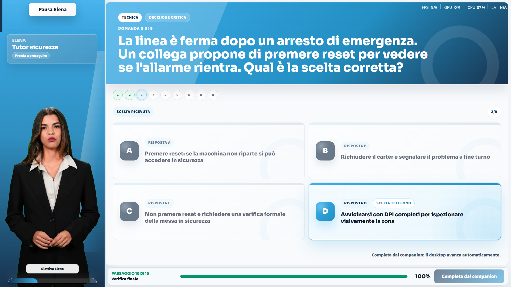

### Decisione Critica

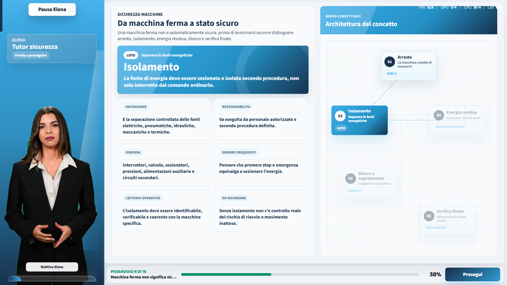

### Semaforo Del Rischio

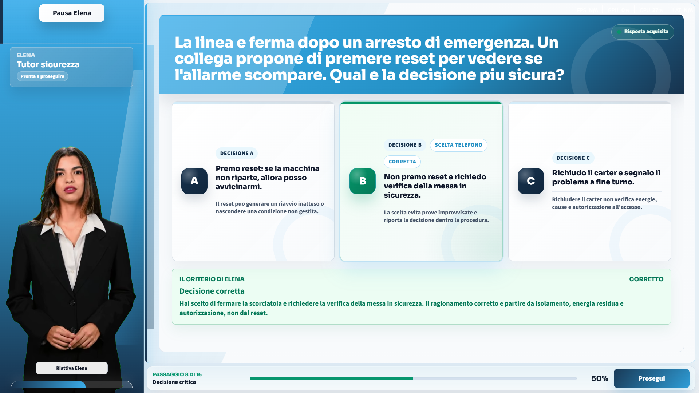

### Quiz Finale

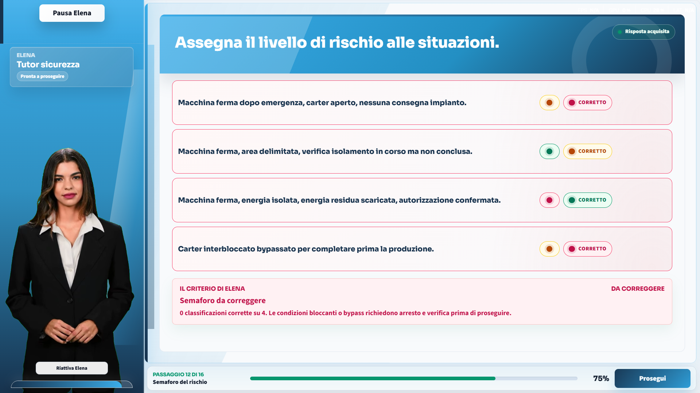

### Debrief Finale

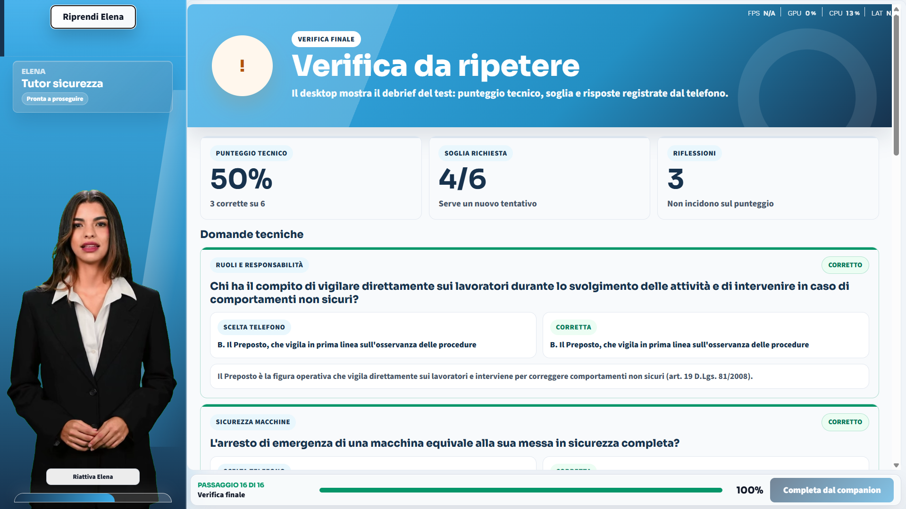

### Presa Visione

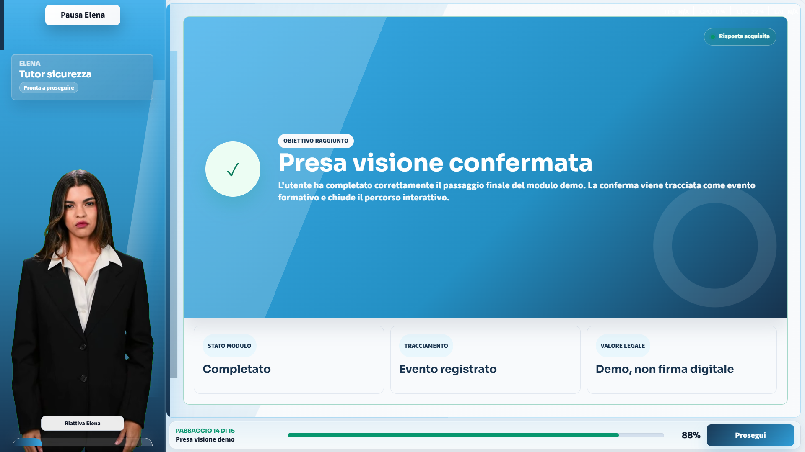

### Companion Mobile

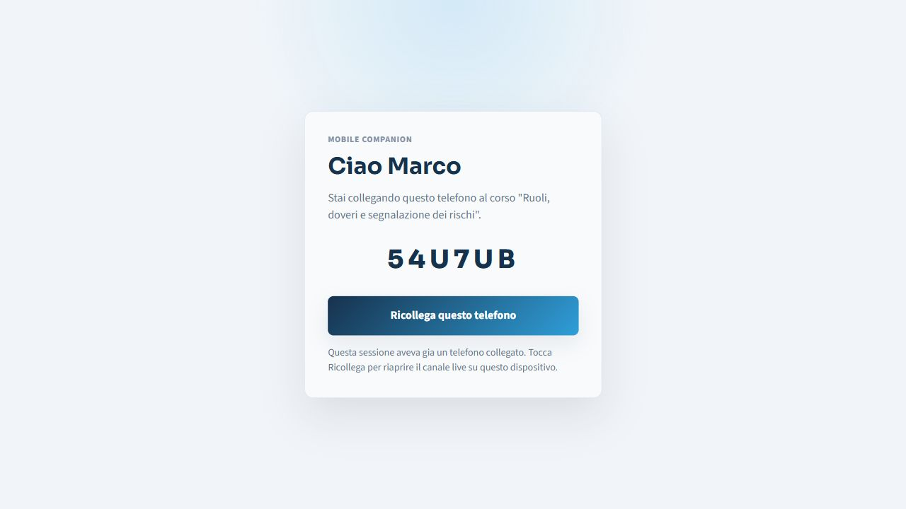

## Avatar Pipeline

Uno degli aspetti centrali del progetto e la pipeline di generazione dell'avatar.

I testi dell'avatar sono stati scritti e revisionati manualmente per ogni blocco della lezione: dal benvenuto iniziale fino al test finale. A partire da questi testi e stato creato uno script automatico capace di produrre in sequenza tutti gli asset necessari al corso.

La pipeline combina due servizi separati:

- **ElevenLabs** per la generazione della voce.
- **HeyGen** per l'avatar video con lip sync.

Il processo e stato pensato per trasformare un copione didattico in asset pronti per la web app:

1. testo del blocco formativo;
2. generazione della voce;
3. generazione del video avatar sincronizzato sul parlato;
4. esportazione iniziale in MP4 con green screen;
5. rimozione del green screen;
6. conversione in **WebM VP9 con canale alpha**, cosi l'avatar puo essere sovrapposto all'interfaccia senza sfondo visibile;
7. integrazione delle clip nel course player.

Questa scelta permette di mantenere Elena come presenza visiva stabile dentro l'esperienza, senza trattarla come un semplice video incollato sopra una pagina.

### Media Sample

- [Elena dashboard intro sample](assets/media/elena-avatar-dashboard.webm)
- [Elena interaction sample](assets/media/elena-avatar-sample.webm)

## Sistema A Blocchi

La demo non e costruita come una sequenza rigida di slide. Il corso e composto da blocchi indipendenti: ogni blocco puo essere progettato, modificato o sostituito senza dipendere dagli altri.

Il blocco principale e il **blocco formativo**. Qui l'avatar espone il contenuto piu lungo, mentre il desktop mostra due livelli di supporto:

- **card didattiche**, che approfondiscono i punti del discorso;
- **mappa concettuale**, che tiene traccia degli argomenti trattati.

Entrambi gli elementi si aggiornano in tempo reale seguendo il parlato dell'avatar. In questo modo lo studente non ascolta soltanto una spiegazione: vede il ragionamento prendere forma, passaggio dopo passaggio.

Accanto ai blocchi formativi ci sono blocchi di verifica rapida. L'idea deriva dal micro-learning: invece di concentrare tutta la valutazione in un test finale dopo una lunga spiegazione, il sistema alterna spiegazione breve, esercizio immediato e avanzamento progressivo.

More detail: [Block Architecture](docs/block-architecture.md)

## Dual Screen: Desktop E Telefono

Il desktop non e pensato come unico punto di controllo. Nella demo il desktop e lo schermo didattico: mostra avatar, contenuti, mappe, scenari e risultati. Il telefono e invece il protagonista operativo: permette di avanzare, confermare, rispondere e prendere decisioni.

Nella versione locale, il collegamento funziona sulla stessa rete LAN. In una versione online, il principio sarebbe lo stesso ma distribuito su web: desktop e telefono aprirebbero due indirizzi della stessa applicazione, associati alla stessa sessione tramite codice o QR, e comunicherebbero attraverso una connessione realtime WebSocket/Socket.IO.

La parte importante non e il QR in se, ma il modello d'uso: lo studente guarda il contenuto sullo schermo grande e agisce dal dispositivo che ha gia in mano.

## Evoluzione Prevista

Se la demo verra approvata, il passo successivo sara un sistema di authoring assistito.

L'obiettivo non e generare contenuti normativi da zero. Il sistema partirebbe esclusivamente da informazioni gia verificate, rodate e garantite sui corsi obbligatori di sicurezza. A partire da quei materiali, aiuterebbe a costruire:

- il discorso dell'avatar;
- le informazioni da mostrare nei blocchi formativi;
- le card didattiche;
- le mappe concettuali;
- gli esercizi coerenti con ciascun blocco.

La revisione umana resterebbe obbligatoria in ogni fase. Non solo per ragioni normative, ma per una scelta progettuale: nella formazione sulla sicurezza, l'automazione deve velocizzare la produzione, non sostituire la responsabilita editoriale e didattica.

## Architecture At A Glance

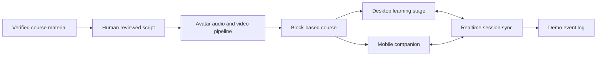

## Tecnologie Usate Nel Progetto Privato

La build privata e stata realizzata con:

- React 18, TypeScript e Vite
- CSS Modules
- Zustand
- Framer Motion
- Lucide React
- React Router
- Socket.IO
- Node.js ed Express
- Zod
- Vitest
- HeyGen
- ElevenLabs
- pipeline video WebM VP9 alpha

## Scope E Riservatezza

Questo repository non include:

- codice frontend;
- codice backend;
- tipi TypeScript condivisi;
- script privati;
- file `.env`;
- log di sviluppo;
- payload API o dettagli implementativi interni;
- documentazione non sanificata del progetto privato.

Il suo scopo e permettere a recruiter, valutatori e stakeholder di comprendere idea, architettura, qualita visuale e direzione prodotto senza esporre l'implementazione privata.

## Media Publishing Notes

Per una presentazione pubblica efficace, il README dovrebbe aprirsi con un breve video walkthrough:

```md
[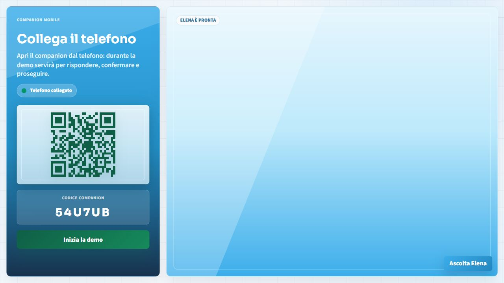](https://your-video-link.example)
```

GitHub README non e il luogo piu affidabile per embed video complessi. La soluzione consigliata e usare una thumbnail cliccabile che porti a un MP4 caricato su GitHub Release/Issue, YouTube, Vimeo o portfolio personale.

Per la nuova capture: [Demo Content Capture Plan](docs/demo-content-capture-plan.md)
