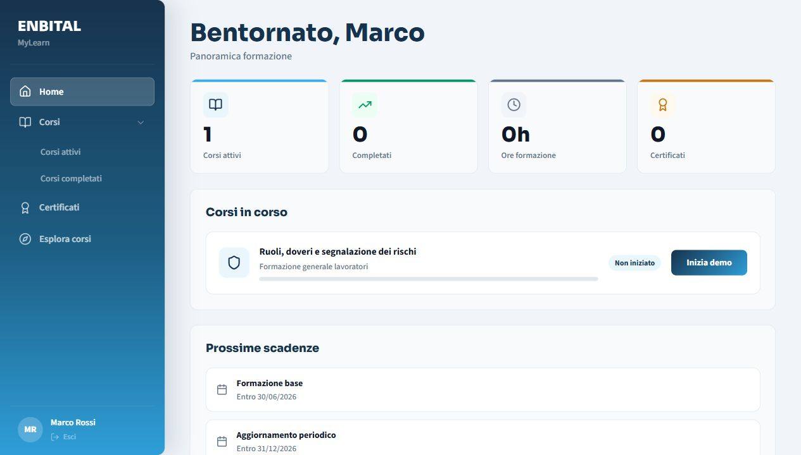
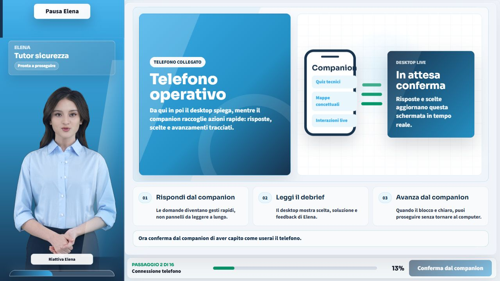
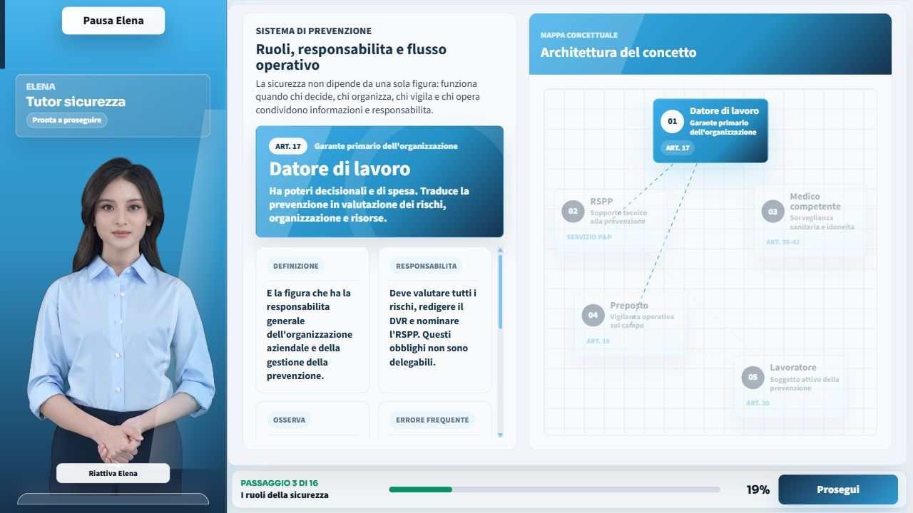
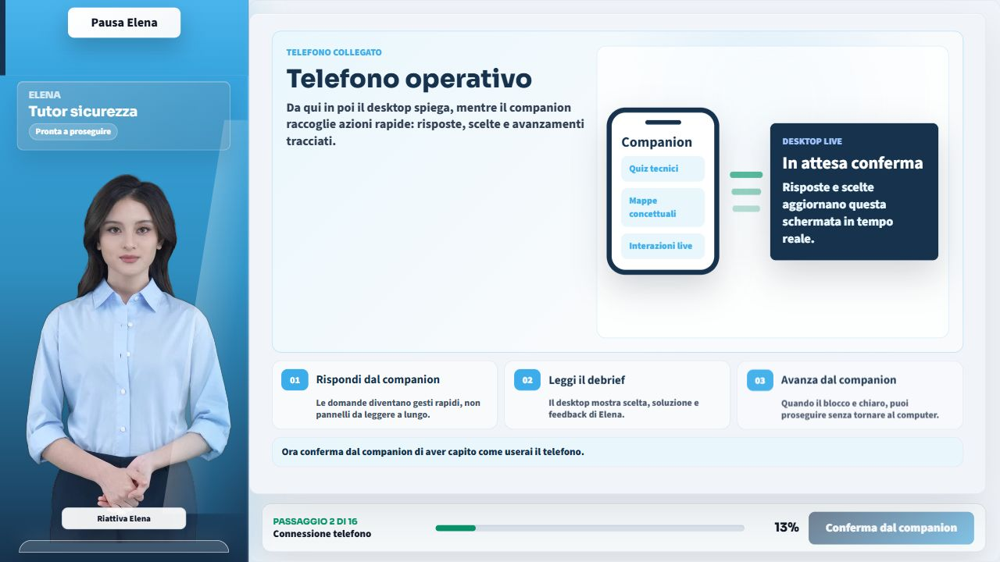
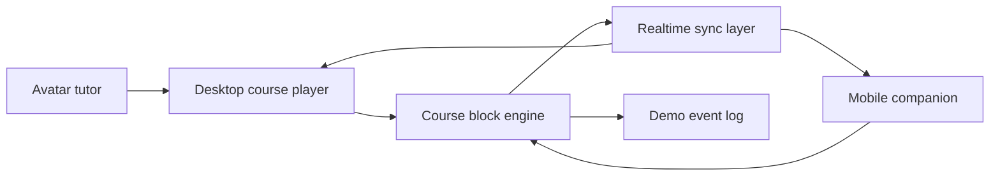

# MyLearn Enbital - Public Showcase

> Public portfolio page for a private e-learning demo.  
> This repository intentionally contains **documentation and media only**: no application source code, no private implementation files, no environment variables.

MyLearn Enbital is a prototype for modern workplace-safety training: a guided learning experience where a desktop course player, a mobile companion and an avatar tutor work together in real time.

The demo was built as a vertical slice to show how mandatory safety training can move beyond passive video lessons and become interactive, traceable and easier to evaluate.

## What This Project Demonstrates

- A dual-device training flow: desktop as the teaching stage, phone as the interaction device.
- An avatar tutor, Elena, that introduces topics and keeps the course experience guided.
- A block-based learning architecture: each course step is a reusable narrative or interaction block.
- Real-time synchronization between desktop and mobile companion.
- Interactive safety exercises: hotspot selection, multiple choice, procedure ordering, scenario decisions, true/false sprint and risk classification.
- A final quiz and a demo event log to show participation tracking.
- A visual language designed for a B2B training product, not a generic slide deck.

## Demo Preview

### Dashboard



### Course Entry And Avatar


### Mobile Pairing



### Concept Map Lesson



### Live Interaction



### Mobile Companion


## Avatar Media Samples

GitHub README rendering is limited, so video files are linked directly here. For the best public portfolio result, use a short edited MP4 walkthrough hosted through a GitHub Issue, Release asset, YouTube, Vimeo or a personal portfolio page.

- [Elena dashboard intro sample](assets/media/elena-avatar-dashboard.webm)
- [Elena interaction sample](assets/media/elena-avatar-sample.webm)

## Architecture At A Glance



The course is organized as a sequence of blocks. Some blocks explain concepts, some ask the learner to act from the phone, and some summarize or evaluate progress. The important idea is that each block has a clear role in the learning journey and can be composed into a course without treating the lesson as a static video.

More detail: [Block Architecture](docs/block-architecture.md)

## Learning Flow

1. The learner enters from a dashboard.
2. The desktop opens the course player and introduces Elena, the avatar tutor.
3. The learner pairs a phone using a QR code or companion code.
4. The desktop presents the lesson, scenarios and visual feedback.
5. The phone becomes the active input device for answers, confirmations and decisions.
6. The final quiz reviews the key safety concepts and produces a demo summary.

## Technologies Used In The Private Build

The private implementation was built with:

- React 18, TypeScript and Vite
- CSS Modules
- Zustand
- Framer Motion
- Lucide React
- React Router
- Socket.IO
- Node.js and Express
- Zod
- Vitest

Only the product concept, visuals and architecture notes are public in this repository.

## Scope And Confidentiality

This repository does not include:

- frontend source code;
- backend source code;
- shared TypeScript types;
- private scripts;
- `.env` files;
- raw project logs;
- proprietary course internals beyond the public-facing concept.

The goal is to let recruiters and evaluators understand the product thinking, architecture and final user experience without exposing the private demo implementation.

## Media Publishing Notes

For a polished public README, add a short walkthrough video near the top:

```md
[](https://your-video-link.example)
```

Recommended video structure:

- 5 seconds: dashboard and course entry.
- 10 seconds: Elena avatar and QR/mobile pairing.
- 20 seconds: desktop lesson plus mobile interaction.
- 10 seconds: final quiz and tracking summary.

More detail: [Media Publishing Guide](docs/media-publishing-guide.md)

